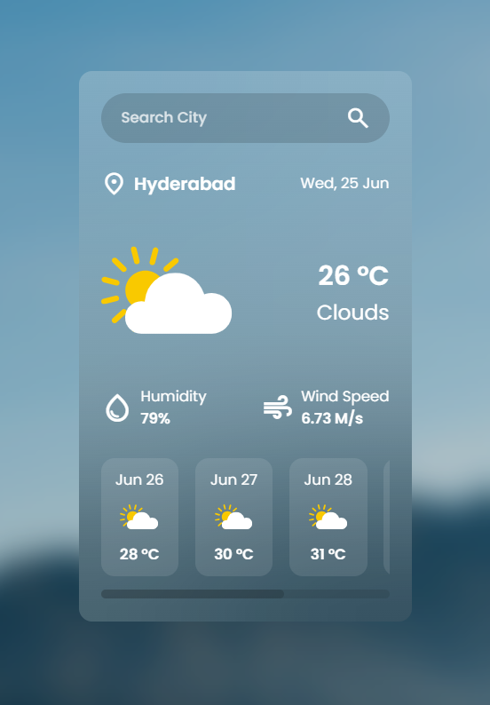

# 🌤️ Weather App

A simple and responsive weather application built using **HTML**, **CSS**, and **JavaScript**. It uses the **OpenWeatherMap API** to show real-time **current weather** and a **5-day forecast** for any city in the world.


## 🚀 Live Demo

[🎬 Watch Demo](demo/demoV.mp4)


## 🔥 Features

- Search weather by **city name**
- Shows **current weather**: temperature, humidity, wind speed, weather description, icon
- Displays **5-day weather forecast**
- Clean, modern, and **responsive UI**
- Works on desktop and mobile


## 🛠️ Built With

- HTML
- CSS
- JavaScript
- [OpenWeatherMap API](https://openweathermap.org/api)


## 📦 Getting Started

### ✅ Prerequisites

- A modern web browser
- A free API key from [OpenWeatherMap](https://openweathermap.org/api)

### 📥 Installation

```bash
git clone https://github.com/your-username/weather-app.git
cd weather-app
```

### 🔑 Setup

1. Get your API key from OpenWeather
2. Open the JavaScript file (e.g. script.js)
3. Replace the placeholder with your API key:

```js
const apiKey = "YOUR_API_KEY_HERE";
```

### ▶️ Run

Just open the index.html file in your browser.

### 📸 Screenshots




